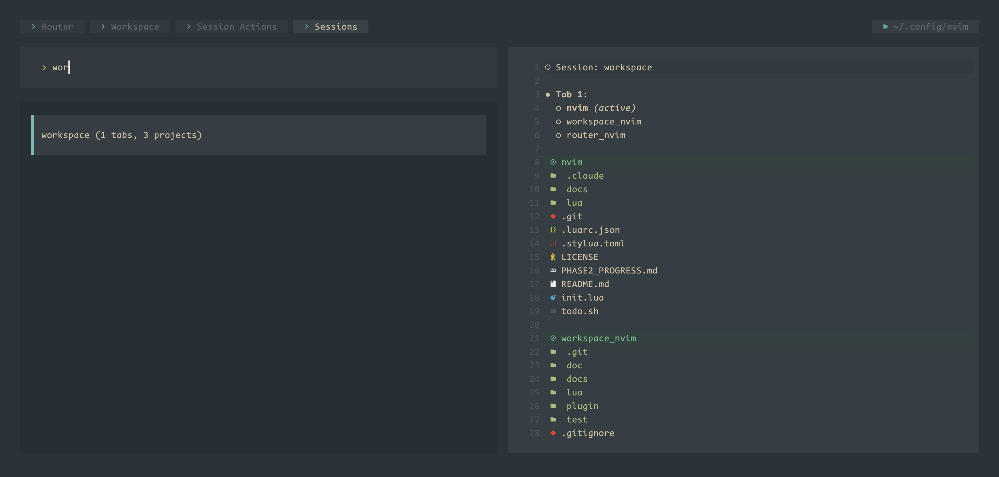

# workspace.nvim

Group your repositories into named workspaces of sessions, tabs, and
projects — with cross-root search, multi-root LSP, and persistent recovery.

## Preview



## Why workspace.nvim?

Neovim assumes **one** project at a time: a single cwd, one set of LSP
roots, and built-in sessions that snapshot a directory rather than the
several repos you're actually juggling. The moment real work spans an API,
a web client, and some shared libs, you're `cd`-ing by hand, losing your
layout when you switch features, and searching one root at a time.

workspace.nvim models that reality. Repos become reusable **projects**;
you group them into named **sessions** and arrange them across **tabs**,
where each tab fixes a cwd and a set of projects that scope grep and LSP.
Switch sessions to jump between feature work and the whole layout comes
back; search and language servers follow the active tab's roots instead of
a single directory.

## Overview

workspace.nvim introduces a four-layer hierarchical model for project management:

- **Project**: A global, reusable code repository or directory. Managed centrally in `projects.json`.
- **Session**: A named, persistent top-level work unit containing a complete workspace state.
- **Workspace**: A container of tabs within a session. Manages the collection of open tabs and their active state.
- **Tab**: The core work unit, holding a current working directory and a set of projects. The tab determines the scope for search and LSP operations.

All persistence (sessions, project registry) is stored in `~/.local/share/nvim/workspace/`.

## Install

Using [lazy.nvim](https://github.com/folke/lazy.nvim):

```lua
{
  "bytedance/workspace.nvim",
  dependencies = {
    "folke/snacks.nvim",  -- required for picker UI
  },
  opts = {
    -- configuration (see Setup section below)
  },
}
```

## Setup

Configure workspace.nvim with an annotated example:

```lua
require("workspace").setup({
  -- Data directory (default: ~/.local/share/nvim/workspace)
  data_dir = vim.fn.stdpath("data") .. "/workspace",

  -- Project configuration
  project = {
    -- Markers to identify project roots during discovery
    default_markers = { ".git", ".project", ".workspace" },

    -- ID generation strategy for new projects
    id_strategy = "basename",  -- "basename" | "hash" | "user"

    -- Auto-register missing projects when loading a session
    auto_register_on_load = true,

    -- Preset projects: registered on startup
    presets = {
      -- Full form: { path = "...", id = "...", meta = {...} }
      { path = "~/maplec/maple_static", id = "maple_static", meta = { lang = "cpp" } },
      { path = "~/maplec/maple/OpenArkCompiler/src", id = "OpenArkCompiler" },
      -- Short form: just path, id derived automatically
      "~/local/scripts",
      "~/.config/nvim",
    },

    -- Auto-scan globs on startup (disabled by default for fast startup)
    auto_scan = {
      enabled = false,
      globs = {
        "~/codehub/*",
        "~/github/*/*",
      },
      markers = { ".git", ".project" },
      max_depth = 3,
    },

    -- Picker preview settings
    preview = {
      command = "eza",  -- "eza" | "tree" | "fd" | "builtin"
      depth = 2,
      show_hidden = false,
      respect_gitignore = true,
      show_meta = true,
      max_entries = 200,
    },
  },

  -- Session configuration
  session = {
    -- Auto-save current session on VimLeavePre
    autosave_on_exit = true,

    -- Auto-load last session on startup (default: false)
    autoload_last_on_startup = false,

    -- Confirm before switching sessions
    confirm_before_load = true,

    -- Per-tab snapshot backend (selects how each tab's window/buffer state
    -- is captured into a session file).
    --
    --   "winlayout"      pure-lua nested split tree + per-window cursor.
    --                    Zero dependencies, current default behavior.
    --   "mksession"      :mksession per-tab + sanitization. Captures more
    --                    options (folds, resize, ...) at the cost of running
    --                    Vim's session writer. Output is sanitized to drop
    --                    cross-tab control commands.
    --   "resession-auto" use resession.nvim if installed, else fall back to
    --                    "winlayout". This is the default.
    snapshot_backend = "resession-auto",

    -- Picker preview settings
    preview = {
      show_tab_labels = true,
      show_project_active_marker = true,
      show_modified_at = true,
      show_buffer_count = false,  -- shows buffer count (read-heavy)
    },
  },

  -- Persistent tab/project state, independent of named sessions.
  -- When enabled, mutations (add project to tab, switch active, ...)
  -- are written to <data_dir>/state.json and rehydrated at cold-start.
  -- Default OFF: cold-start no-session is meant to be ephemeral —
  -- explicit :SessionSave is the canonical persistence path.
  persistent_state = {
    enabled = false,
    debounce_ms = nil,  -- defaults to session.autosave_debounce_ms
  },

  -- Tab and workspace configuration
  tab = {
    cwd_strategy = "active_project",  -- "active_project" | "manual"
    fallback_grep_to_cwd = true,
  },

  -- LSP configuration
  lsp = {
    auto_register_workspace_folders = true,
    excluded_clients = { "rust_analyzer" },
  },

  -- UI configuration
  ui = {
    picker = "snacks",  -- "snacks" | "telescope"
    -- vim.ui.select shim — re-route any plugin's selection prompt
    -- through Snacks.picker.select with the host-pinned router layout.
    override_vim_select = true,

    -- Snacks.explorer follow-active-project bridge.
    explorer = {
      auto_follow_active_project = true,  -- on TabActiveChanged → :Neotree-style refocus
      follow_current_file        = true,  -- reveal current file in tree
    },

    -- Multi-root explorer source (Scheme B, experimental).
    -- When enabled, registers a "workspace_explorer" Snacks picker source
    -- that lists all projects on the current tab as top-level items;
    -- selecting one drills into a single-root explorer at that root.
    -- Bind a host keymap (e.g. <leader>nw) to
    -- require("workspace.integration.explorer_multiroot").open()
    explorer_multiroot = { enabled = false },

    -- Alpha.nvim dashboard "recent sessions" section.
    dashboard = { alpha_section = false },
  },
})
```

## Commands

All commands are organized by namespace: Project, Session, Workspace, Tab, and Router.

### Project Commands

| Command | Arguments | Description |
|---|---|---|
| `:ProjectAdd` | `<path> [id]` | Register a project globally |
| `:ProjectInit` | `[path]` | Promote a directory (default: cwd) to a project. If no marker (`.git`/`.project`/`.workspace`) is present, writes a `.project` JSON file with `{version, id, name, created_at, meta}` so the directory carries its own authoritative id/name. Idempotent. |
| `:ProjectRemove` | `<id>` | Remove a project from the registry |
| `:ProjectList` | — | Open project picker (default: add to current tab) |
| `:ProjectDiscover` | `<glob>` | Scan directories and register projects matching glob |
| `:ProjectRename` | `<id> <name>` | Rename a project |
| `:ProjectMove` | `<id> <new_path>` | Re-root a project to a new directory (fires `WorkspaceProjectUpdated`) |
| `:ProjectEdit` | `[id]` | Interactively edit a project's name, root, and meta JSON |
| `:ProjectReload` | — | Reload projects.json from disk |

### Session Commands

| Command | Arguments | Description |
|---|---|---|
| `:SessionSave` | `[name]` | Save current session (name optional) |
| `:SessionLoad` | `<name>` | Load a named session |
| `:SessionDelete` | `<name>` | Delete a session |
| `:SessionList` | — | Open session picker (default: load) |
| `:SessionRename` | `<old> <new>` | Rename a session |
| `:SessionInfo` | — | Show current session info (tabs, projects) |

### Workspace Commands

| Command | Arguments | Description |
|---|---|---|
| `:WorkspaceNewTab` | `[project_id]` | Create a new tab (optionally with a project) |
| `:WorkspaceCloseTab` | — | Close current tab |
| `:WorkspaceSwitchTab` | `<idx>` | Switch to tab by index |
| `:WorkspaceMoveTab` | `<from> <to>` | Reorder tabs |
| `:WorkspaceList` | — | Open workspace tab picker |
| `:WorkspaceProjects` | — | Show all projects across all tabs in current session |
| `:WorkspaceGrep` | `[pattern]` | Live grep across all projects in all tabs |
| `:WorkspaceGrepWord` | — | Grep cursor word across all session roots |
| `:WorkspaceScopedGrep` | `[pattern]` | Grep with multi-project scope picker |
| `:WorkspaceScopedFind` | `[pattern]` | Find files with multi-project scope picker |
| `:WorkspaceSession` | — | Open session sub-router (router-styled menu) |
| `:WorkspaceProject` | — | Open project sub-router |
| `:WorkspaceTab` | — | Open tab sub-router |
| `:WorkspaceOps` | — | Open ops (new tab / move / list) sub-router |
| `:WorkspaceSearch` | — | Open search sub-router |
| `:WorkspaceMigrateFromProjections` | `[--dry-run] [path]` | Import projects from projections.nvim's `projections.json` |

### Tab Commands

| Command | Arguments | Description |
|---|---|---|
| `:TabAddProject` | `[id]` | Add a project to current tab. When the tab had no projects before, the new project also becomes the active one and `:tcd` switches to its root. No-arg variant opens the project picker. |
| `:TabRemoveProject` | `[id]` | Remove a project from current tab. No-arg variant opens picker. |
| `:TabSwitchProject` | `[id]` | Set the active project in current tab + `:tcd`. |
| `:TabProjects` | — | Show projects in current tab. |
| `:TabRename` | `<label>` | Rename current tab. |
| `:TabGrep` | `[pattern]` | Live grep within current tab's project roots. |
| `:TabGrepWord` | — | Grep cursor word within current tab's project roots. |
| `:TabFind` | `[pattern]` | Find files within current tab's project roots. |
| `:TabSymbols` | — | Show LSP symbols for current tab |
| `:TabSaveAs` | `<name>` | Save current tab as a reusable template |
| `:TabLoad` | `<name>` | Load a tab template |

### Router Entry

| Command | Arguments | Description |
|---|---|---|
| `:Workspace` | — | Open workspace router (hierarchical command browser) |

## Recommended Keymaps

Set up convenient access to frequently-used commands:

```lua
local wk = require("which-key")

wk.add({
  { "<leader>w", group = "workspace" },
  { "<leader>ws", "<cmd>SessionList<cr>", desc = "Switch session" },
  { "<leader>wp", "<cmd>ProjectList<cr>", desc = "Add project to tab" },
  { "<leader>wl", "<cmd>WorkspaceList<cr>", desc = "Switch tab" },
  { "<leader>wn", "<cmd>WorkspaceNewTab<cr>", desc = "New tab" },
  { "<leader>wc", "<cmd>WorkspaceCloseTab<cr>", desc = "Close tab" },
  { "<leader>wg", "<cmd>TabGrep<cr>", desc = "Grep in tab" },
  { "<leader>wf", "<cmd>TabFind<cr>", desc = "Find files in tab" },
})

-- Or use router entry point for hierarchical menu
wk.add({ "<leader>W", "<cmd>Workspace<cr>", desc = "Workspace router" })
```

## Events

workspace.nvim emits the following `User` autocmd events for integration with
other plugins. The canonical list is registered in
[`lua/workspace/integration/autocmds.lua`](lua/workspace/integration/autocmds.lua).
Each entry below names the event, the file:line where it fires, and the shape
of `event.data` passed to the autocmd callback.

### Tab events

Fired from `lua/workspace/tab/api.lua` via `lua/workspace/tab/events.lua:5`
(pattern is built as `"WorkspaceTab" .. name`).

- `WorkspaceTabProjectAdded` — `lua/workspace/tab/api.lua:39`
  - data: `{ tabnr = number, project_id = string }`
- `WorkspaceTabProjectRemoved` — `lua/workspace/tab/api.lua:63`
  - data: `{ tabnr = number, project_id = string }`
- `WorkspaceTabActiveChanged` — `lua/workspace/tab/api.lua:83`
  - data: `{ tabnr = number, project_id = string }`
- `WorkspaceTabCwdChanged` — `lua/workspace/tab/api.lua:97`
  - data: `{ tabnr = number, cwd = string }`
- `WorkspaceTabRenamed` — `lua/workspace/tab/api.lua:141`
  - data: `{ tabnr = number, label = string }`
- `WorkspaceTabReordered` — `lua/workspace/tab/api.lua:152`
  - data: `{ from = number, to = number }` (tabnr pair)

### Project registry events

Fired from `lua/workspace/project/registry.lua`.

- `WorkspaceProjectRegistered` — `lua/workspace/project/registry.lua:115`
  (fired when a brand-new project id is added)
  - data: `{ id = string, project = Project }`
- `WorkspaceProjectUpdated` — `lua/workspace/project/registry.lua:115`
  (fired when an existing project id is re-registered)
  - data: `{ id = string, project = Project }`
- `WorkspaceProjectUnregistered` — `lua/workspace/project/registry.lua:161`
  - data: `{ id = string }`

### Session events

Fired from `lua/workspace/session/api.lua`.

- `WorkspaceSessionSaved` — fired after the session JSON is written to disk.
  - data: `{ name = string }`
- `WorkspaceSessionLoaded` — fired after a session is restored.
  - data: `{ name = string }`
- `WorkspaceSessionDeleted` — fired after a session file is deleted.
  - data: `{ name = string }`
- `WorkspaceSessionRenamed` — fired after a session is renamed on disk.
  - data: `{ from = string, to = string }`

### Reactive sync

The eight registry / session / tab mutation events above are also subscribed
internally by [`lua/workspace/integration/router_refresh.lua`](lua/workspace/integration/router_refresh.lua).
When any of them fires while a router-rendered Snacks picker is open, the
bridge invalidates router's `items()` cache and re-opens the current node
so the list reflects the post-mutation state without a manual refresh.

The bridge invalidates the cache even when no picker is open — the next
`:ProjectList` / `:SessionList` / `:Workspace` shows fresh data, so you do
not need to restart Neovim after a CLI `:ProjectDiscover` or
`:ProjectMove`.

### Subscribing

Use `vim.api.nvim_create_autocmd()` with `event = "User"` and the event name as
`pattern`:

```lua
vim.api.nvim_create_autocmd("User", {
  pattern = "WorkspaceSessionLoaded",
  callback = function(event)
    local session_name = event.data.name
    vim.notify("Loaded session: " .. session_name)
  end,
})

vim.api.nvim_create_autocmd("User", {
  pattern = "WorkspaceTabProjectAdded",
  callback = function(event)
    local tabnr      = event.data.tabnr
    local project_id = event.data.project_id
    -- ...
  end,
})
```

## Storage

workspace.nvim stores all persistent data in `~/.local/share/nvim/workspace/`:

```
~/.local/share/nvim/workspace/
├── projects.json           -- global project registry
├── state.json              -- persistent tab/project metadata (opt-in)
├── sessions/
│   ├── fullstack.json      -- session "fullstack"
│   ├── debugging.json      -- session "debugging"
│   └── ...
└── tab_templates/
    ├── frontend.json       -- tab template "frontend"
    ├── backend.json        -- tab template "backend"
    └── ...
```

**projects.json** is a single source of truth for all projects. Sessions reference projects by ID, making it safe to update project metadata (paths, names) in one place.

**sessions** store the complete state of a named work unit: all tabs, their projects, active project, and Neovim state (buffers, layout).

**tab_templates** allow saving individual tab configurations for reuse across different sessions.

### Persistent state (state.json)

**Default off.** Enable via `cfg.persistent_state.enabled = true` for
IDE-style "remember tab/project layout across nvim restarts" behavior.

When enabled, `state.json` holds the *metadata* layer of your workspace
— per-tab labels, order, cwd, project_ids, active_project_id —
independent of any named session. Every reactive mutation (project
register/update/unregister, tab project add/remove/active-change/cwd/
rename/reorder) is debounced and flushed to this file, even when no
session is active. On startup `workspace.setup()` non-disruptively
rehydrates the in-memory tab state from `state.json` *before* any
user command runs, so cold-start no-session edits survive a restart.

`state.json` deliberately excludes the `nvim_state` (winlayout / buffer
list) blob — that's session-only. `:SessionLoad` writes through
`state.json` immediately after a successful restore so the two layers
stay coherent.

When `enabled = false` (the default), tab/project mutations remain
purely in-memory; explicit `:SessionSave <name>` is the canonical
persistence path.

Defaults:

```lua
require("workspace").setup({
  persistent_state = {
    enabled     = true,   -- default on
    debounce_ms = nil,    -- defaults to session.autosave_debounce_ms (500)
  },
})
```

Set `persistent_state.enabled = false` to disable the augroup entirely
(no rehydrate, no writes).

## Router Integration

workspace.nvim integrates with [router.nvim](https://github.com/bytedance/router.nvim), providing a hierarchical command menu accessible via `:Workspace` or `:Router` (if router is installed).

See [picker-router-workspace.md](../../../.config/nvim/picker-router-workspace.md) for detailed router subtree structure and navigation.

If router.nvim is not installed, all commands remain available via `:` directly.

## Troubleshooting

### LSP not registering workspace folders

Check that the LSP client is not in the `excluded_clients` list in your config. Some clients like `rust_analyzer` require manual configuration and should be excluded.

### projects.json corruption or permission errors

If `projects.json` is read-only or corrupted:

1. Check file permissions: `ls -la ~/.local/share/nvim/workspace/projects.json`
2. Backup and rebuild: `cp projects.json projects.json.bak && rm projects.json`
3. Re-register projects: `:ProjectAdd <path>` or `:ProjectDiscover <glob>`

### Session fails to load

If a session references a project that no longer exists on disk:

1. Run `:ProjectReload` to update the registry
2. Use `:SessionList` to see which projects are missing
3. Update or delete the project reference manually in the session JSON if needed

### Slow startup with auto_scan enabled

Disable auto-scanning in your config:

```lua
project = {
  auto_scan = { enabled = false },
}
```

Projects can be registered manually with `:ProjectAdd` or `:ProjectDiscover`.

## Snapshot Format

Each session JSON contains, per tab, an `nvim_state` field holding a
JSON-encoded blob describing the tab's window layout:

```
{
  "kind"   : "winlayout",
  "layout" : <vim.fn.winlayout()>,
  "wins"   : { "<winid>": { "file", "cursor", "topline" }, ... },
  "files"  : [ <visible file paths> ]
}
```

On restore, `snapshot.restore` walks `layout` to recreate the exact split
structure (`row` → `:vsplit`, `col` → `:split`, `leaf` → `:edit`), then
applies cursor and topline per window. A workspace-level
`listed_buffers` array carries every globally-listed buffer at save time
so `:badd`-only hidden buffers are also restored.

The legacy `kind = "files"` blob is still accepted on load for sessions
saved by earlier versions.

## Integrations

### Alpha dashboard

When `cfg.ui.dashboard.alpha_section = true` and at least one session is
saved, `require("workspace.ui.dashboard").alpha_section()` returns an
alpha.nvim-compatible group of buttons listing the most recently
modified sessions. Each button calls `session.load(name, { force = true })`.
Returns `nil` otherwise so the host can skip rendering.

### NvChad tabufline

`require("workspace.integration.tabufline").setup()` is invoked from
`workspace.setup()` (pcall-wrapped). It detects NvChad and registers a
`User WorkspaceTabRenamed` autocmd that calls `:redrawtabline`. NvChad's
`tabufline.modules.tabs()` does not expose an extension point for
injecting workspace labels; hosts that want the workspace label rendered
should override `tabs()` and call
`require("workspace.ui.tabline").tab_name(tabnr)` themselves.

### Snacks.explorer (sidebar)

`require("workspace.integration.explorer").setup()` is invoked from
`workspace.setup()` (pcall-wrapped). When
`cfg.ui.explorer.auto_follow_active_project` is truthy (default), the
module registers a `User WorkspaceTabActiveChanged` autocmd in the
`WorkspaceExplorerFollow` augroup. Each fire calls
`Snacks.picker.explorer({ cwd = <new active project root> })`. Snacks
re-uses the existing `"explorer"` source picker, so the sidebar window
is updated in place rather than re-opened. The host owns the
sidebar's position (default for this stack: right) and the
`follow_file`/`git_status`/`watch` flags via the snacks plugin spec —
see the host's `lua/plugins/router.lua`.

If no explorer picker is currently open, the handler is a no-op, so
the integration is safe to leave on even when the sidebar is hidden.

```lua
ui = {
  explorer = {
    auto_follow_active_project = true,  -- default
    follow_current_file        = true,  -- default; host snacks config
                                        --   reads follow_file directly
  },
}
```

The module also exposes `pick_root_for_explorer()`, a quick picker
that lists the current tab's projects via `vim.ui.select` and switches
the explorer root to the chosen project WITHOUT mutating the tab's
active project (use `<leader>tp` for that). Hosts can bind it to e.g.
`<leader>np`:

```lua
vim.keymap.set("n", "<leader>np", function()
  require("workspace.integration.explorer").pick_root_for_explorer()
end, { desc = "Workspace: pick explorer root" })
```

### Multi-root explorer (experimental)

`require("workspace.integration.explorer_multiroot")` ships an opt-in
multi-root sidebar via a custom Snacks.picker source named
`workspace_explorer`. When enabled, the picker's top level lists every
project on the current tab as a folder row; selecting a row drills into
a regular single-root `Snacks.picker.explorer({ cwd = <root> })` for
that project. The list refreshes on the eight reactive sync events plus
`WorkspaceTabActiveChanged` (which never relocates the picker — all
roots are preserved regardless of the active project).

Default off. Enable via:

```lua
ui = {
  explorer_multiroot = {
    enabled = true,
  },
}
```

Recommended host keymap:

```lua
vim.keymap.set("n", "<leader>nw", function()
  require("workspace.integration.explorer_multiroot").open()
end, { desc = "Workspace: multi-root explorer" })
```

Approach (see `DESIGN_NOTES.md`): we register
`Snacks.picker.sources.workspace_explorer` at `setup()`-time with our
own finder that yields `{ file = root, dir = true, ... }` per project.
This avoids coupling to Snacks's `Tree` singleton and delegates per-root
file rendering / file-ops back to Snacks's stock single-root explorer.

Deferred features (tracked under Future Work): inline subtree expansion
in the same picker, diagnostics overlay on project rows, file-op actions
across roots from the multi-root view, full per-root git_status, and
file-watch debouncing across roots.

## Testing

Unit tests (plenary.busted) live in `test/spec/` (191 specs as of writing):

```bash
cd workspace.nvim
nvim --headless -c "PlenaryBustedDirectory test/spec"
```

End-to-end regression probe in `test/regression.lua` exercises the full
`setup → command → mutation → refresh → snapshot → restore` flow under
a sandboxed temp `data_dir` with mocked Snacks picker:

```bash
nvim --headless --clean -u NONE -l test/regression.lua
```

Exit code is `0` when all 29 checks pass, `1` otherwise.

## Shipped (experimental)

### Scheme B — multi-root Snacks.explorer source

A custom `Snacks.picker.sources.workspace_explorer` source ships in
`lua/workspace/integration/explorer_multiroot.lua`, default off. See
the "Multi-root explorer (experimental)" subsection above for the
opt-in flag, the recommended `<leader>nw` keymap, and the v1 contract.
Detailed investigation and trade-off notes are in `DESIGN_NOTES.md`.

## Future Work

### Multi-root explorer — v2 enhancements

The current v1 (Scheme B) ships top-level project rows that drill into
single-root explorers. Tracked enhancements for the next iteration:

- Inline subtree expansion (file children rendered in the same picker
  rather than opening a new explorer on confirm).
- Diagnostics overlay on project rows.
- Cross-root file-op actions (add / del / rename / copy / move) directly
  from the multi-root view.
- Full per-root `git_status` aggregation on the project rows.
- File-watch debouncing across multiple roots so external mutations on
  any project root refresh the multi-root view live.

## Special Thanks

- [folke/snacks.nvim](https://github.com/folke/snacks.nvim) — its `picker`
  powers every selection prompt and the cross-root search UI.
- [nvzone/volt](https://github.com/nvzone/volt) — the rendering toolkit
  behind the router-styled picker this plugin integrates with.
- [NvChad/base46](https://github.com/NvChad/base46) — the highlight system
  the picker theming derives its colors from.
